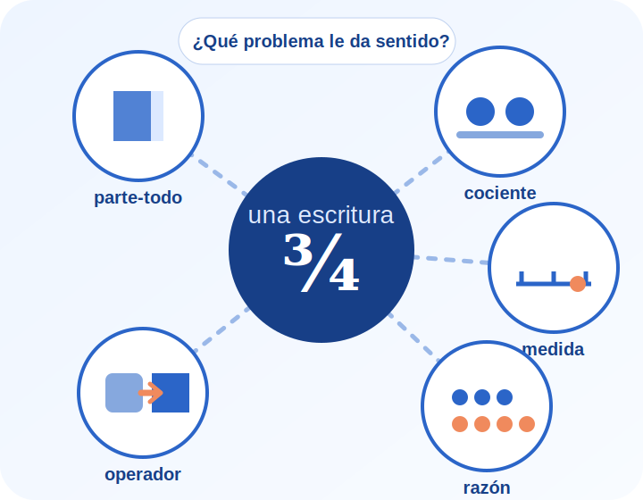

# Una misma escritura, muchos sentidos

## Cápsula interactiva de AMAE sobre la enseñanza de los números racionales

Proyecto listo para publicar en GitHub Pages. Está destinado a estudiantes del Profesorado Universitario en Matemática de la Universidad Nacional del Comahue y propone estudiar las fracciones, los decimales y los números racionales como **asunto de enseñanza**, no sólo como un conjunto de definiciones y técnicas.

La pregunta que organiza el recorrido es:

> **¿Qué tiene que ocurrir para que `a/b` deje de ser una regla escrita y se convierta en una herramienta para repartir, medir, comparar y transformar?**

La cápsula toma como núcleo las páginas 1 a 7 de la actividad proporcionada por el docente y articula esas consignas con las lecturas incluidas en el archivo de materiales. Las páginas 8 a 13 de la actividad, dedicadas a una construcción geométrica con GeoGebra, no se incorporaron porque corresponden a otro foco temático.

---

## Concepto pedagógico y cuatro etapas

La experiencia combina una secuencia general obligatoria con navegación no lineal dentro de cada etapa. El docente controla cuándo se habilita cada etapa mediante un código.

### 1. La IA arma el primer mapa

La respuesta de una inteligencia artificial se usa como **objeto de análisis**, no como autoridad. Los estudiantes construyen un prompt, examinan los límites de las tablas comparativas y fijan criterios para evaluar una producción de IA.

### 2. Cinco sentidos, una escritura

Es el núcleo principal. Se trabajan los significados de la fracción como **parte-todo, cociente, medida, razón y operador**. Cada tarjeta presenta una situación, una tensión didáctica y una relación con los materiales teóricos. Incluye un laboratorio para revisar afirmaciones típicas generadas por IA.

### 3. Escalar cambia el problema

Reúne el rompecabezas, la fotografía con referencia, la ampliación de una imagen y la duplicación del cubo. La etapa permite discutir el efecto de un factor racional sobre longitudes, áreas y volúmenes, y anticipar errores asociados con la proporcionalidad.

### 4. De la técnica al estudio

Integra las actividades anteriores desde la perspectiva del proceso de estudio. Los estudiantes comparan enseñar una técnica con organizar condiciones para explorar, producir, explicar, validar y reutilizar conocimientos.

Al completar las cuatro etapas se habilita una **síntesis interactiva de tres casos**, con devoluciones pedagógicas y una bitácora personal guardada mediante `localStorage`.

---

## Estructura del proyecto

```text
capsula-racionales-amae/
├── index.html
├── README.md
├── css/
│   └── estilos.css
├── js/
│   └── app.js
└── assets/
    ├── img/
    │   ├── hero-fracciones.svg
    │   ├── mapa-significados.svg
    │   ├── parte-todo.svg
    │   ├── cociente.svg
    │   ├── medida.svg
    │   ├── razon.svg
    │   ├── operador.svg
    │   ├── escala-cubo.svg
    │   └── rompecabezas-escala.svg
    ├── audio/
    │   ├── guia-significados.wav
    │   └── pausa-reflexiva.wav
    ├── video/
    │   └── microvideo-escalas.mp4
    └── lecturas/
        ├── consigna_fracciones_racionales.pdf
        ├── freudenthal_capitulo_5_fracciones.pdf
        ├── itzcovich_capitulo_5_fracciones.pdf
        ├── llinares_sanchez_interpretaciones_fracciones.pdf
        ├── aportes_numeros_racionales_nivel_medio.pdf
        ├── vergnaud_campos_conceptuales.pdf
        ├── cedron_explicaciones_racionales.pdf
        └── chevallard_estudiar_matematicas.pdf
```

No usa frameworks, paquetes ni procesos de compilación. Puede abrirse directamente con doble clic sobre `index.html`.

---

## Códigos de las etapas

Los códigos actuales están al comienzo de `js/app.js`:

```js
const CODIGOS = Object.freeze({
  1: 'PREGUNTA',
  2: 'SENTIDOS',
  3: 'ESCALAS',
  4: 'ESTUDIO'
});
```

Para cambiarlos:

1. Abrir `js/app.js` con un editor de texto.
2. Reemplazar solamente las palabras entre comillas.
3. Conservar la numeración, las comas y las comillas.
4. Guardar el archivo y volver a cargar la página.

Los códigos no distinguen entre mayúsculas y minúsculas. Son un recurso de regulación didáctica, no una medida de seguridad: al tratarse de una página estática, una persona con conocimientos técnicos puede leerlos en el archivo JavaScript.

La constante siguiente mantiene el orden obligatorio:

```js
const ORDEN_OBLIGATORIO = true;
```

Cambiarla a `false` permite habilitar cualquier etapa con su código, aunque la anterior no esté completa.

---

## Reemplazar imágenes, audios y videos

La forma más simple es conservar los nombres actuales y reemplazar los archivos dentro de sus carpetas.

### Imágenes

Colocar las nuevas imágenes en:

```text
assets/img/
```

Las rutas se encuentran en las etiquetas `` de `index.html`. Ejemplo:

```html

```

Al cambiar una imagen, también debe revisarse el atributo `alt`.

### Audio de la etapa 1

Reemplazar:

```text
assets/audio/guia-significados.wav
```

### Música o pausa reflexiva

Reemplazar:

```text
assets/audio/pausa-reflexiva.wav
```

### Microvideo de escalas

Reemplazar:

```text
assets/video/microvideo-escalas.mp4
```

Se recomienda usar MP4 con codificación H.264 para mayor compatibilidad. Si se cambia la extensión, también hay que modificar la ruta y el atributo `type` de la etiqueta `<source>` en `index.html`.

Los audios actuales usan voces sintéticas y la pausa musical es una pieza original generada para esta cápsula. El video es un recurso breve producido para acompañar el análisis de escalas.

---

## Cambiar títulos y textos

Todo el contenido visible está en `index.html` y está separado por comentarios:

```html
<!-- PORTADA / HERO -->
<!-- PROPÓSITO -->
<!-- MAPA DE NAVEGACIÓN Y DESBLOQUEO -->
<!-- ETAPA 1: IA -->
<!-- ETAPA 2: CINCO SIGNIFICADOS -->
<!-- ETAPA 3: ESCALAS -->
<!-- ETAPA 4: PROCESO DE ESTUDIO -->
<!-- ACTIVIDAD INTERACTIVA FINAL -->
<!-- BITÁCORA -->
<!-- BIBLIOGRAFÍA -->
```

Para modificar una devolución de la actividad final, buscar `const CASOS` en `js/app.js`.

---

## Cambiar colores y apariencia

Los colores principales están definidos como variables al comienzo de `css/estilos.css`:

```css
:root {
  --azul-900: #102f68;
  --azul-800: #173f87;
  --azul-700: #2356ad;
  --azul-100: #dce9ff;
  --fondo: #f7faff;
  --blanco: #ffffff;
  --texto: #20304a;
}
```

Cambiar una variable actualiza todos los componentes que la utilizan. Conviene conservar suficiente contraste entre texto y fondo.

---

## Cómo funciona la bitácora

Las notas, las etapas habilitadas y el progreso se guardan en `localStorage`. Esto significa que:

- la información permanece sólo en el navegador y dispositivo del estudiante;
- no se envía a un servidor;
- se pierde al borrar los datos del sitio o usar otro navegador;
- el botón **Descargar bitácora en TXT** genera una copia local para entregar o conservar;
- el botón **Reiniciar recorrido** borra el avance y las notas guardadas.

La clave utilizada se encuentra en `js/app.js`:

```js
const CLAVE_ESTADO = 'amae-racionales-estado-v1';
```

Cambiar esa clave crea un recorrido nuevo para todos los navegadores que abran la versión actualizada.

---

## Publicar en GitHub Pages

1. Crear un repositorio nuevo en GitHub.
2. Subir **el contenido de esta carpeta** a la raíz del repositorio. `index.html` debe quedar en el nivel principal.
3. Abrir la pestaña **Settings** del repositorio.
4. Entrar en **Pages**.
5. En **Build and deployment**, seleccionar **Deploy from a branch**.
6. Elegir la rama `main` y la carpeta `/ (root)`.
7. Presionar **Save**.
8. Esperar unos minutos y abrir la dirección que GitHub indique.

No es necesario modificar las rutas porque todas son relativas.

---

## Comprobar que todo funcione

Después de abrir `index.html` o la publicación en GitHub Pages, revisar este recorrido:

1. La portada aparece y los botones llevan a Propósito y Mapa.
2. El código `PREGUNTA` habilita la etapa 1.
3. La etapa 1 se completa después de escribir una nota de al menos 20 caracteres.
4. El código `SENTIDOS` habilita la etapa 2 sólo después de completar la etapa 1.
5. La etapa 2 exige explorar al menos cuatro significados, realizar el laboratorio de IA y escribir una nota.
6. El código `ESCALAS` habilita la etapa 3.
7. El simulador modifica longitudes, áreas y volúmenes al mover el control.
8. El código `ESTUDIO` habilita la etapa 4.
9. Al completar las cuatro etapas se habilita la síntesis de tres casos.
10. La bitácora conserva las notas al recargar la página y permite exportarlas.
11. Todas las pantallas incluyen un botón para volver al mapa.
12. La navegación puede realizarse con teclado usando `Tab`, `Enter` y la barra espaciadora.

Para simular un primer ingreso, usar **Reiniciar recorrido** o borrar los datos del sitio en el navegador.

---

## Decisiones de diseño

- Se eligió el título **Una misma escritura, muchos sentidos** porque concentra la tensión central de los materiales: la notación fraccionaria no tiene un único significado y sólo adquiere sentido en relación con clases de situaciones.
- La secuencia general es obligatoria para respetar la progresión de la actividad, pero cada etapa ofrece entradas internas no lineales.
- Las lecturas se presentan en fragmentos de trabajo y constelaciones, no como un texto académico continuo.
- La etapa de los cinco significados ocupa el lugar principal y contiene el análisis más explícito del uso de IA.
- Los recursos multimedia cumplen funciones específicas: el audio abre una pregunta; el esquema permite comparar; el video organiza la variación de escala; la música introduce una pausa antes de la escritura.
- La secuencia “cuestión, técnicas, explicación, reorganización y reutilización” es una reconstrucción pedagógica inspirada en el proceso de estudio; no pretende reproducir literalmente los momentos teóricos de Chevallard, Bosch y Gascón.

---

## Autoría y uso de inteligencia artificial

Propuesta para la asignatura **Actividad matemática como asunto de enseñanza (AMAE)** del Profesorado Universitario en Matemática de la Universidad Nacional del Comahue.

La inteligencia artificial generativa se utilizó para apoyar el análisis de los materiales, la organización de la experiencia, la programación, la producción de ilustraciones vectoriales y la generación de recursos sonoros y audiovisuales. La selección, la adecuación institucional y la implementación final corresponden al equipo docente. No se incorporaron autores ni referencias ajenos a los archivos proporcionados.
